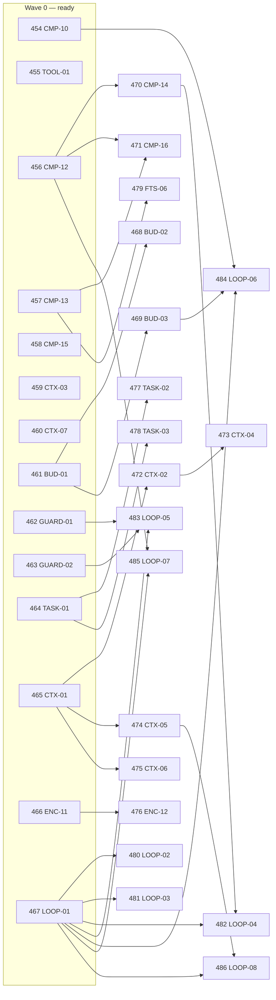

# Plan compliance audit — session-storage.md & context-management.md

_Generated 2026-05-29 by the `plan-compliance-audit` workflow (18 audit agents → adversarial gap verification → synthesis). Build/test ground truth captured separately._

## Verdict at a glance

- **Build:** ✅ clean (`cargo build --workspace`), **592 tests pass, 0 fail, 1 ignored**.
- **Requirements audited:** 178 across 18 dimensions → ✅ 110 implemented · 🟡 25 partial · ❌ 43 missing.
- **session-storage.md:** ~88% landed and well-tested. A mature, faithful implementation; remaining gaps are loop-wiring, not storage primitives.
- **context-management.md:** mostly **not yet built** (32 of 50 requirements missing). The storage substrate it depends on exists, but the request-assembly, budgeting, loop-guard, and subagent layers are largely absent.
- **Shared compaction:** data/algorithm layer is solid; several guards and triggers exist as **unwired modules** (built + unit-tested but never called by the live run loop).

### Highest-impact gaps (cross-cutting)

1. **The live agent run loop (`agents/mod.rs`) is single-dialect.** It hardcodes the OpenAI Chat Completions encoder/decoder, never dispatches on `ApiKind`, never attaches `previous_response_id`, never persists `provider_state`, and resolves a global default model instead of `session.settings.modelRef`. So cross-provider replay, mid-session model switch, and Responses/Anthropic encoding all work *in tests* but are unreachable from the running server.
2. **Compaction guards are built but unwired.** `AntiThrashingBreaker`, `CompactionFailureBreaker`, and the `degrade` pre-pass are fully implemented and unit-tested, but never constructed/called outside their own tests — they guard nothing in production.
3. **No proactive token budgeting.** Compaction is purely *reactive* (fires only on a provider context-limit error). The hybrid estimator, image token estimate, two-scope budget, and ~60% prune trigger from context-management.md §6 do not exist — so "well under threshold but still 400s" is unguarded.
4. **Context-management §2, §5, §7-subagents are greenfield.** 3-block cacheable system prompt, cache_control breakpoints, `prompt_cache_key`, `<system-reminder>` injection, progressive skill disclosure, step budget, doom-loop guard, and the `task` subagent tool are all unimplemented.

> Note: a few gaps reflect a genuine **conflict between the two plan docs** (e.g. pruned-result placeholder text, tool output caps, the `## Files` summary section). The code follows session-storage.md; context-management.md asks for more. These need a doc reconciliation decision, not just code.

## session-storage.md

### `S1-db-open` — ✅9

The S1-db-open dimension is fully and faithfully implemented. data_dir resolution, 0700/0600 permissions, all five open pragmas with exact plan values, WAL->DELETE locking-protocol fallback (with single WARNING), BEGIN IMMEDIATE + 20-150ms jittered retry (up to 15), periodic wal_checkpoint(PASSIVE) every 50 writes, declarative schema reconciliation via PRAGMA table_info + ALTER TABLE ADD COLUMN, and batch/flush-at-turn-boundary persistence are all present, correct, and (mostly) covered by tests. Constants match the plan exactly. Two notable improvements over the literal plan wording: (1) locking-protocol detection matches the structured SQLITE_PROTOCOL error code rather than the message text "locking protocol" (more robust, semantically equivalent), and (2) reconciliation additionally validates index compatibility and rejects incompatible/required-missing columns. The only minor gap is the absence of a dedicated test asserting --data-dir arg precedence OVER NAV_DATA_DIR (the code ordering is unambiguous and env/default are each tested).

### `S2-id-scheme` — ✅4

The ID scheme is implemented faithfully and matches the plan in all four checked requirements. Protocol-visible IDs (SessionId, RunId, MessageId, ToolCallId, RequestId, EventId, ApprovalId, FileChangeId) are validated as lowercase UUIDv7 via a dedicated macro; storage-only IDs (PartId/prt_, ArtifactId/art_, ProviderPayloadId/pay_) carry an embedded 16-hex-digit millisecond timestamp followed by an entropy field, are declared Ascending, and expose created_at_millis() to extract the timestamp. Cursor pagination on turns uses exactly the plan's (created_at, id) DESC keyset SQL with limit+1 to derive `more` and the next cursor, and a dedicated test proves stability across a concurrent insert. No divergences from plan values were found.

### `S3-canonical-model` — ✅15

The canonical domain model from the plan's "Canonical domain model" section (plans/session-storage.md lines 147-271) is fully and faithfully implemented in crates/nav-harness/src/sessions/canonical.rs. Every required type is present with the exact fields the plan specifies: the Turn envelope, TurnRole enum, TurnMeta (including parent_id), and all 11 Part variants with their exact field shapes. Serialization uses a "type" snake_case discriminator matching the plan, and round-trip tests in crates/nav-harness/tests/canonical_parts.rs exercise every variant, ImageSource branch, ProviderOpaque, and TurnMeta. The only deviations are purely additive (a raw_payload caching field on ProviderOpaque and an extra in-memory ModelTurn/TurnPart/ToolCall family used for request building) and do not contradict the plan. Note the actual code lives under crates/nav-harness/... not the nav-harness/... path given in the task brief.

### `S4-schema` — ✅9

The SQLite schema in crates/nav-harness/src/sessions/migrate.rs matches the plan's "SQLite schema" section (plans/session-storage.md:273-475) closely and completely. All eight plan tables (schema_migrations, sessions, runs, turns, provider_payloads, turn_parts, provider_state, artifacts) exist with the specified columns, types, NOT NULL/DEFAULT constraints, UNIQUE constraints, indexes, and the full REFERENCES ... ON DELETE CASCADE / SET NULL chain. The schema is duplicated in two forms: a canonical CORE_SCHEMA_SQL DDL string (lines 9-127) and a declarative TableSchema/IndexSchema reconciliation model (lines ~290-857) used for self-healing ALTER TABLE ADD COLUMN, matching the plan's "Declarative schema reconciliation" appendix (plan:824-827, 958-964). foreign_keys=ON is set and asserted in tests, so cascades are enforced. Minor benign divergences from the literal plan: code adds a turn_parts_text FTS projection table + index (a later FTS issue, out of this section's scope) and a UNIQUE index idx_artifacts_sha256 not in the plan DDL. No turns.parts_json column exists (correct). I found no dedicated cascade-delete behavior test, though the constraints and pragma are present and pragma is tested.

### `S5-store-api` — ✅23 🟡1

The SessionStore API from the plan is substantially and faithfully implemented. The low-level storage layer is the struct `SqliteSessionStore` in crates/nav-harness/src/sessions/sqlite.rs (the plan calls it `SessionStore`; the name `SessionStore` is actually used for a thin higher-level facade in store.rs that wraps SqliteSessionStore and adds payload-recovery + domain helpers). Every plan method exists on SqliteSessionStore with matching semantics: seq is assigned via `COALESCE(MAX(seq),-1)+1` inside the insert transaction; cost is accumulated with `SET cost = cost + ?`; cost is reversed-then-reapplied on part replace and reversed on removal; cursor pagination uses `(created_at, id)`; update_part_delta uses SQL `json_set` append. The only real divergences are: (1) there is no separate public `migrate(&self)` method — migration is folded into `open()` and runs automatically; (2) a few method signatures differ from the plan's sketch (update_part takes an explicit part_id, remove_part omits session_id and derives it, finish_run takes finished_at+error_json instead of RunError, set_provider_state takes the run_id inside ProviderState). All behaviors have dedicated unit and integration test coverage (tests/sqlite_session_store.rs).

| Status | Requirement | Evidence / Gap |
|---|---|---|
| 🟡 partial | migrate() method (pub fn migrate(&self) -> Result<()>) | Plan spec: /Users/season/Personal/nav/plans/session-storage.md:484 lists `pub fn migrate(&self) -> Result<()>;` as a distinct method on `SessionStore`. Implementation: the only `migrate` function is the standalone module fn `pub fn migrate(conn: &Connection) -> Result<(), MigrationError>` at /Users/ |

### `S6-encode-decode` — ✅9 🟡3

The encoder/decoder boundary is implemented thoroughly and largely matches the plan. All four ApiKind dialects exist with dedicated encoders and decoders; decode reliability rules (persist-before-trust, unknown -> ProviderOpaque + decoded_with_unknowns, structural provenance via provider_payload_id + JSON pointer, per-dialect decoder_version, batched streaming) are present and exercised by tests. The provider_payloads/turn_parts DDL matches the plan. The main gaps are in "Encoding failures on old turns": the degrade pre-pass (drop Thinking / degrade tool activity to text) exists as compaction::degrade but is NOT wired into the live agent encode loop (only tests call it); the agent loop hardcodes the OpenAiChatCompletions encoder rather than dispatching by ApiKind; and the DecodeStatus Rust enum omits a Pending variant (pending exists only as a DB string), so the persist-then-recover path is keyed off raw status strings. Minor naming divergence: the enum variant is OpenAiCompletions, not the plan's OpenAiChatCompletions (encoder/decoder types do use the OpenAiChatCompletions name).

| Status | Requirement | Evidence / Gap |
|---|---|---|
| 🟡 partial | Encoding failures on old turns: drop Thinking / degraded tool-activity-as-text / last-resort compaction | Mechanisms exist but are not wired into the live encode path: (1) degrade_for_dialect + degrade_part (crates/nav-harness/src/compaction/degrade.rs:76-152) implement step 1 (DroppedThinking when !supports_thinking, lines 123-128) and step 2 (unpaired ToolCall/ToolResult -> synthetic_text, lines 129-1 |
| 🟡 partial | Encoder/decoder boundary table fidelity (Load->Prune->Truncate->Encode->Persist envelope->Decode->Save) and dialect-dispatched encoder selection | crates/nav-harness/src/agents/mod.rs:551-559 (encode_completion_request hardcodes OpenAiChatCompletionsEncoder::new(); returns OpenAiCompletionsRequest); :124 (run loop calls it unconditionally); :595-635 append_decoded_response hardcodes OpenAiChatCompletionsDecoder::new() / OPENAI_CHAT_COMPLETIONS |
| 🟡 partial | DecodeStatus enum models pending\|decoded\|decoded_with_unknowns\|failed\|ignored | crates/nav-harness/src/sessions/sqlite.rs:128-145 — `pub enum DecodeStatus { Decoded, DecodedWithUnknowns, Failed, Ignored }` with only an `as_str` writer mapping those 4 variants to "decoded"/"decoded_with_unknowns"/"failed"/"ignored"; no `Pending` variant and no `from_str`/parse from the DB. The ` |

### `S7-reliability-fixtures` — ✅9

All five reliability-verification cases from plan section "Reliability verification" (plans/session-storage.md:839-862) are implemented with passing fixtures/tests, and in most cases exceed the plan's minimum. Case 1 (raw envelope survives decoder loss) is covered for every dialect with ProviderOpaque placeholders plus an explicit get_artifact exact-bytes assertion. Case 2 (re-decode pending after restart) is covered both by SessionStore::open auto-recovery tests that move pending->decoded/decoded_with_unknowns with provider_payload_id-linked parts, and by an explicit decode-then-append-then-assert-status test. Case 3 (per-dialect round trips) covers all five named dialects — Chat Completions, Responses, ChatGPT/Codex subscription, Anthropic Messages, and an OpenAI-compat gateway with extra fields — asserting text, tool calls, tool results, finish_reason, usage, and reasoning artifacts. Case 4 (cross-provider replay) decodes one dialect, swaps ApiKind, and re-encodes canonical turns into another dialect (CC->Anthropic, Responses->Anthropic) without reading provider JSON as source of truth. Case 5 (crash window) is covered by a pending-survives-restart test, a malformed-payload-not-dropped test, and a full recovery orchestration (recover_pending_provider_payload) that marks visible 'failed' rows with error_json for unknown api_kind / artifact-read / decode-fail / panic / save-fail, all exercised by passing tests. I ran the relevant test files and all passed (cross_provider_replay 3/3, canonical_decoder, openai_compat_gateway 10/10, chatgpt_subscription_decoder 5/5, sqlite_session_store provider_payload 9/9, recover_payloads 1/1, inline store recovery tests 24/24). Minor note: the dedicated nav-backend recover_payloads.rs integration test only covers the older-decoder diff-report path, not failure recovery — but failure recovery is thoroughly covered by inline store.rs unit tests.

### `S8-agent-loop` — ✅7 🟡6 ❌2

The plan's agent-loop building blocks exist and are well-tested at the SessionStore + encoder/decoder layer: start_run, finish_run, list_turns_for_run, provider payload journaling, a transactional "append turns + mark decoded + (optional) set provider_state + update cost" path, OpenAI-Responses/Subscription previous_response_id chaining keyed by run_id and api_kind, and mid-session provider_state invalidation via update_session_settings when api_kind changes. However, the LIVE agent loop (nav-harness/src/agents/mod.rs RunLoop + nav-server orchestration) only wires the OpenAI Chat Completions dialect. It hardcodes OpenAiChatCompletionsEncoder regardless of api_kind, never attaches previous_response_id, never calls set_provider_state, never calls update_session_settings (so mid-session swap + invalidation is unreachable from the running server), does not pass system_prompt/compat into the encode call, and resolves the model via resolve_default() (global default) rather than session.settings.modelRef. There is also no context::truncate step (the context module is a stub). So the storage-layer requirements are largely implemented, but the loop-level orchestration of api_kind dispatch, provider_state chaining/persistence, and mid-session model change is only partially realized — exercised by tests but not by the production run loop.

| Status | Requirement | Evidence / Gap |
|---|---|---|
| ❌ missing | Loop: optional context::truncate(turns, budget) -> turns_for_model | crates/nav-harness/src/context/mod.rs:1-9 is a stub: only `pub mod system_prompt;` plus an empty unit struct `pub struct ContextManager;` (never referenced anywhere — grep for ContextManager returns only its own definition). No `fn truncate`, no `budget`/`max_tokens`/`context_window` symbol in the c |
| ❌ missing | Loop: if api_kind == OpenAiResponses, attach previous_response_id from provider_state when valid | agents/mod.rs:551-559 `encode_completion_request(turns, tool_registry, tool_preset) -> OpenAiCompletionsRequest` unconditionally builds `OpenAiChatCompletionsEncoder::new().with_tool_registry(...)` — no `model`/`api_kind`/`provider_state`/`run_id` params and no branch on `OpenAiResponses`. It is the |
| 🟡 partial | Step 1: resolve_model(session.settings.modelRef) -> ResolvedModelConfig { api_kind, ... } | crates/nav-server/src/http/model_run.rs:87 `let model = match resolver.resolve_default()` (the agent run loop entry). crates/nav-server/src/http/mod.rs:590-591 spawn_model_run passes `&model_resolver` and uses resolve_default(); mod.rs:640 auto-title also calls resolve_default(). resolve_default()/r |
| 🟡 partial | Loop: list_turns_for_run(run_id) to reconstruct prior context each iteration | Function exists and works: crates/nav-harness/src/sessions/store.rs:582 try_turns_for_run -> sqlite.rs:1326 list_turns_for_run; covered extensively in crates/nav-harness/tests/sqlite_session_store.rs and http_protocol.rs. Live loop entry: crates/nav-server/src/http/mod.rs:400 loads turns once via se |
| 🟡 partial | Loop: encode(api_kind, turns, system_prompt, tools, compat) -> EncodedRequest | crates/nav-harness/src/agents/mod.rs:124 (call site) and :551-559 (fn encode_completion_request): signature is `encode_completion_request(turns: &[ModelTurn], tool_registry: &ToolRegistry, tool_preset: ToolPreset)` and the body hardcodes `OpenAiChatCompletionsEncoder::new().with_tool_registry(...)`. |
| 🟡 partial | Loop: decode(api_kind, response_payload_id, response) -> new_turns_with_parts | crates/nav-harness/src/agents/mod.rs:606-607 — the only decode call site in the live loop: `OpenAiChatCompletionsDecoder::new().decode(&OpenAiChatCompletionsDecodeInput {...})`, hardcoded, with no `match model.api`. agents/mod.rs:557 — encode side is likewise hardcoded to `OpenAiChatCompletionsEncod |
| 🟡 partial | Loop: transactional append_turns + mark payload decoded + update provider_state + update cost | sqlite.rs:767-819 append_decoded_provider_payload_with_provider_state performs all four ops in one execute_write txn: insert_turn per decoded turn (788-790), UPDATE provider_payloads decode_status/decoder_version/decoded_at (791-806), set_provider_state_in_tx when Some (810-812), update_session_cost |
| 🟡 partial | Mid-session model change updates settings only (no migration of historical rows) | Storage primitive present and correct: SessionStore::update_session_settings at /Users/season/Personal/nav/crates/nav-harness/src/sessions/sqlite.rs:894-914 runs `UPDATE sessions SET settings_json=?, updated_at=? WHERE id=?` and conditionally calls invalidate_stale_provider_state(tx, session_id, api |
## Shared compaction (both plans)

### `CMP1-pruning` — ✅4 🟡2 ❌3

The cheap pruning pipeline is substantially implemented and well-tested in crates/nav-harness/src/compaction/prune.rs and replay.rs: compacted_at-based pruning, the 40K PRUNE_PROTECT tail budget, SHA256 content-hash dedup, JSON-preserving tool-call argument truncation, and image stripping all exist with dedicated tests in tests/compaction_replay.rs, and the turn_parts.compacted_at column / compact_part() write path are present. However, several requirements diverge from the plan: (1) protected tools only cover "skill", not "skill/todo"; (2) per-tool output caps are wrong — read and bash both use the shared 50KB byte cap, not the plan's read=4000 / bash=5000 char caps; (3) there is NO ~60% context-window trigger — pruning runs unconditionally on every encode loop iteration; (4) the one-line summary projection (e.g. "[read_file] read src/main.rs: exit code 0, 1.2K chars.") from context-management.md Stage 2 is NOT implemented — pruned content is replaced with the static "[Old tool result content cleared]" placeholder (which matches the session-storage.md wording, so the two plan docs conflict and the code follows session-storage.md). Image-strip placeholder text and media-retention count also diverge from context-management.md.

| Status | Requirement | Evidence / Gap |
|---|---|---|
| ❌ missing | Output caps: read capped at 4000 chars, bash capped at 5000 chars | crates/nav-harness/src/tools/read.rs:93 calls truncate_output(&numbered, TruncationOptions::default()). crates/nav-harness/src/tools/bash.rs:169-174 bash_truncation_options() returns TruncationOptions { strategy: TruncationStrategy::Tail, ..TruncationOptions::default() } — only the strategy is overr |
| ❌ missing | One-line summary projection at encode-time (e.g. '[read_file] read src/main.rs: exit code 0, 1.2K chars.') | crates/nav-harness/src/compaction/prune.rs:10 defines OLD_TOOL_RESULT_CONTENT_CLEARED = "[Old tool result content cleared]". prune.rs:78-82 (project_model_turns_for_tool_result_pruning) sets pruned ToolResult content to that constant. crates/nav-harness/src/compaction/replay.rs:194-208 (tool_result_ |
| ❌ missing | Trigger pruning at ~60% of context window | crates/nav-harness/src/agents/mod.rs:116-122 (run loop calls prune_stored_tool_results_for_encoding + project_model_turns_for_tool_result_pruning every iteration, unconditionally, no token gate); crates/nav-harness/src/compaction/prune.rs:9 (PRUNE_PROTECT_TOKENS=40_000) and prune.rs:30-83 (tool_resu |
| 🟡 partial | Protected tools (skill/todo) exempt from pruning | crates/nav-harness/src/compaction/prune.rs:13 `const PROTECTED_TOOL_NAMES: &[&str] = &["skill"];` — only "skill", no "todo". Used at prune.rs:118-123 (StoredTurn path) and prune.rs:174-179 (ModelTurn path) to skip tool results whose tool name is in the list. Test crates/nav-harness/tests/compaction_ |
| 🟡 partial | Image/media stripping with placeholder for old media | crates/nav-harness/src/compaction/replay.rs:13 const STRIPPED_IMAGE_CONTENT = "[Attached image — stripped after compression]"; replay.rs:136-143 latest_image_bearing_user_turn_index; replay.rs:32,39 strip_images = index < latest image-bearing user turn; replay.rs:178-181 Part::Image -> synthetic Par |

### `CMP2-summary` — ✅6 🟡1 ❌5

The summarization pipeline (Stage 3) is substantially implemented at the storage/data layer and partially at the orchestration layer. The compaction agent, structured markdown template, summary validation, incremental/iterative summary using the previous summary, Compaction part + synthetic assistant summary turn, and the [marker -> summary -> tail] replay order are all implemented and tested. Tail selection is implemented but turn-count only: tail_turns defaults to 2 (correct), but keep_recent_tokens (20K token-based tail) does not exist anywhere. Several plan requirements are missing entirely: split-turn handling for cut points inside tool-calling sequences, PTL (Prompt Too Long) retry with drop-oldest, the compaction.model_override config with stripped payload, and the cumulative ## Files section from context-management.md. Notably, the template implemented in summary.rs follows the richer context-management variant (Active Task/Goal/Constraints/Completed Actions/Active State/In Progress/Blocked/Key Decisions) but OMITS the ## Files section the plan explicitly requires as cumulative. The failure circuit breaker types exist and are unit-tested but are not wired into the actual run-loop/orchestration, so summary-validation failures do not yet feed the breaker in production code paths.

| Status | Requirement | Evidence / Gap |
|---|---|---|
| ❌ missing | keep_recent_tokens default 20K (token-based tail alternative) | crates/nav-harness/src/sessions/store.rs:126-137 — `struct CompactionConfig { pub tail_turns: usize }` with `Default` setting only `tail_turns: DEFAULT_TAIL_TURNS`. The only tail constant is `DEFAULT_TAIL_TURNS: usize = 2` at crates/nav-harness/src/compaction/replay.rs:19. Repo-wide ripgrep for `kee |
| ❌ missing | Cumulative ## Files section (context-management adds it; previous file lists merged forward) | plans/context-management.md:135-142 mandates a cumulative "## Files" section with "### Read" / "### Modified" subsections, explicitly carried forward across compactions (readFiles/modifiedFiles carry-forward). The implementation omits it entirely: - crates/nav-harness/src/compaction/summary.rs:20-42 |
| ❌ missing | Split-turn handling (cut inside tool-calling sequence: summarize in-progress prefix, stitch, avoid orphan tool calls) | crates/nav-harness/src/sessions/store.rs:1178 select_tail_start_id and store.rs:1196 is_verbatim_replay_turn pick a whole-turn boundary, excluding only compaction markers/summaries — no detection of a cut landing inside an assistant ToolCall -> Tool-result pairing. Tool results ARE stored as separat |
| ❌ missing | PTL (Prompt Too Long) retry: on compaction call context overflow, drop oldest message groups and retry | crates/nav-harness/src/compaction/summary.rs:65-93 (CompactionSummaryAgent::generate) makes a single runtime.block_on(self.client.complete(...))? call with no ContextLimit branch, no drop-oldest logic, and no retry loop. The only caller is crates/nav-harness/src/agents/mod.rs:279-280 (recover_from_o |
| ❌ missing | Compaction model override (compaction.model_override) sending stripped payload (no images, truncated tool results, no full tool defs) | crates/nav-harness/src/agents/mod.rs:279-280 (recover_from_overflow passes the active `model: &ResolvedModelConfig` straight into CompactionSummaryAgent::generate with no override lookup); crates/nav-harness/src/compaction/summary.rs:65-93 (generate(&self, model, request) — model is a caller-supplie |
| 🟡 partial | Summary validation before commit (parse required headings, reject empty/malformed; counts against failure breaker) | Validation logic implemented: crates/nav-harness/src/compaction/validate.rs:82 validate_compaction_summary (checks Empty, TooLong, MODEL_ERROR_MARKERS, MissingSections for all required headings, TooShort). Validated commit wrapper: crates/nav-harness/src/sessions/store.rs:413 compact_session_with_va |

### `CMP3-guards` — ✅5 🟡4 ❌1

The reactive overflow-recovery path (Stage 3 Overflow Replay + Stage 5 terminal fallback) is largely implemented in the RunLoop: a ContextLimit error force-compacts, strips media via replay projection, appends a single synthetic continuation turn, and the single-shot guard (MAX_OVERFLOW_ATTEMPTS=1) prevents a compact->overflow loop, surfacing ContextLimit on the second overflow. The two Stage-4 breakers exist as well-formed, unit-tested modules with correctly distinct counters and the right constants (10% / 2 consecutive / 3 failures). HOWEVER the breakers are completely unwired: AntiThrashingBreaker and CompactionFailureBreaker are never constructed or called anywhere outside their own module and their dedicated unit test, so anti-thrashing suspension and the failure breaker do not actually guard any live run. There is NO rate-limit/5xx ~10min cooldown anywhere in the codebase (no Instant/Duration/cooldown state in breaker.rs or elsewhere). reset() is never invoked, so the "reset on manual /compact or /new" requirement is not satisfied in practice (no /compact or /new handler calls it). Two divergences from the plan in the overflow path: (1) it replays a generic OVERFLOW_CONTINUATION_TEXT prompt rather than re-issuing the original triggering user turn verbatim; (2) it uses compact_session_with_summary (unvalidated) rather than the validated variant, so a malformed summary is not rejected/counted. Stage 5 "drop the summary" step is not implemented — on terminal overflow the summary stays committed and only ContextLimit is surfaced.

| Status | Requirement | Evidence / Gap |
|---|---|---|
| ❌ missing | Rate-limit/5xx cooldown (~10 min) before retrying | Plan requirement: plans/context-management.md:152 — "rate-limit/5xx errors additionally trip a transient cooldown (~10 min) before retrying." Implementation: crates/nav-harness/src/compaction/breaker.rs — CompactionFailureBreaker stores only `threshold: u32` and `failures: HashMap<SessionId, u32>` ( |
| 🟡 partial | Anti-thrashing: <10% saved x2 consecutive -> suspend auto-compaction + warn | Implementation: crates/nav-harness/src/compaction/breaker.rs — AntiThrashingBreaker (struct line 36), LOW_SAVINGS_THRESHOLD=0.10 (line 19), LOW_SAVINGS_LIMIT=2 (line 21), record_auto_compaction (line 55), decide_auto_compaction returns AutoCompactionDecision::Skip{warning} (lines 69-77), low_savings |
| 🟡 partial | Failure circuit breaker: 3 consecutive call failures -> disable auto-compaction | crates/nav-harness/src/compaction/breaker.rs: CompactionFailureBreaker (line 121), DEFAULT_COMPACTION_FAILURE_THRESHOLD=3, record_failure (line 147), record_success (line 163), auto_compaction_enabled (line 173). The ONLY non-test caller of any breaker method is the internal self-call at breaker.rs: |
| 🟡 partial | Reset both counters on manual /compact or /new | Reset methods exist and are unit-tested: AntiThrashingBreaker::reset (crates/nav-harness/src/compaction/breaker.rs:64) and CompactionFailureBreaker::reset (crates/nav-harness/src/compaction/breaker.rs:168). Tests cover them: reset_clears_the_counter_after_manual_compaction_or_new (compaction_breaker |
| 🟡 partial | Terminal fallback Stage 5: drop summary, surface ContextOverflowError, no auto second pass | Run loop: crates/nav-harness/src/agents/mod.rs:42 (MAX_OVERFLOW_ATTEMPTS = 1), :155-167 (overflow guard + single recover_from_overflow call), :168-180 (flush_stream_error then return RunLoopResult::Failed(error)), :266-298 (recover_from_overflow commits summary via compact_session_with_summary at :2 |
## context-management.md

### `X1-cache-control` — ✅1 🟡4 ❌6

Section 2 (Request Assembly & Cache-Control) is almost entirely unimplemented. The system prompt builder (crates/nav-harness/src/context/system_prompt.rs) emits a single flat string with sections "## Environment / ## Project conventions / ## Tools" — there is no SYSTEM_PROMPT_DYNAMIC_BOUNDARY, no 3-block static/semi-static/volatile split, and the prompt mixes volatile data (date) with semi-static (cwd, OS, tools) in one undifferentiated string. The Anthropic encoder (crates/nav-harness/src/models/encode.rs: AnthropicMessagesRequest with system: Option<String>, tools: Vec<AnthropicToolDefinition>) carries no cache_control breakpoints anywhere — no breakpoint at tools end, static-system end, or rolling last/second-to-last message, and no subagent shift. The OpenAI request body builder (request_body in openai_completions.rs) sets only model/messages/stream/tools/max_tokens/temperature/reasoning/provider — no prompt_cache_key (session id), no prompt_cache_retention, no user field. No <system-reminder> context-reminder injection exists. A repo-wide search for cache_control / prompt_cache_key / prompt_cache_retention / ephemeral cache / breakpoint / SYSTEM_PROMPT_DYNAMIC_BOUNDARY returns zero relevant hits (only an unrelated ephemeral_db_path SQLite test helper). The single requirement partially satisfied is alphabetical tool ordering: the ToolRegistry uses BTreeMap/BTreeSet (crates/nav-harness/src/tools/mod.rs:411-412), so tool_names() and preset_tools() are name-sorted (test tool_names_returns_registered_tools_in_sorted_order at line 616) — but there is no schema in-memory cache keyed by name:hash(schema); AnthropicToolDefinition::from_tool just clones name/description/parameters per build.

| Status | Requirement | Evidence / Gap |
|---|---|---|
| ❌ missing | 3-block system prompt separated by SYSTEM_PROMPT_DYNAMIC_BOUNDARY (Block1 static identity/tone/tool-rules, Block2 semi-static, Block3 volatile) | crates/nav-harness/src/context/system_prompt.rs render() (lines 94-126) builds a single flat String with `## Environment` (OS/cwd/date interleaved, lines 98-101), optional `## Project conventions` (105-112), and `## Tools` (115-123); build() (lines 89-91) returns one ModelTurn::system_text. Repo-wid |
| ❌ missing | Block1 excludes model name and session state to preserve byte-identity across model swaps | crates/nav-harness/src/context/system_prompt.rs (only system-prompt code): SystemPromptBuilder::render() lines 94-126 emits a single flat string with sections "## Environment", "## Project conventions", "## Tools" — no Block 1/2/3 structure, no SYSTEM_PROMPT_DYNAMIC_BOUNDARY, no cache_control. Repo- _(verifier: unverified->missing)_ |
| ❌ missing | Anthropic: up to 4 cache_control breakpoints (tools end, static system end, rolling last + second-to-last message) | crates/nav-harness/src/models/encode.rs:165-170 (AnthropicMessagesRequest = system: Option<String>, messages: Vec<Value>, tools: Vec<AnthropicToolDefinition>), :182-187 (AnthropicToolDefinition = name/description/input_schema only), :240-246 (request() assembles system/messages/tools with no cache_c |
| ❌ missing | Subagent fork: rolling marker shifted one message earlier so the throwaway tail is not written to shared cache | Requirement text: plans/context-management.md:70 (depends on §2.4 breakpoints, lines 63-68). Repo-wide `rg cache_control\|cache-control` returns ZERO matches outside plans/ and research/. The only "cache" tokens in code are telemetry fields tokens_cache_read/tokens_cache_write (crates/nav-protocol/s |
| ❌ missing | OpenAI: prompt_cache_key set to session id; expose prompt_cache_retention (in_memory default, 24h when supported) | crates/nav-harness/src/models/openai_completions.rs:959-1018 request_body() inserts only: model, messages, stream, tools, stream_options, max_completion_tokens/max_tokens, temperature, reasoning (via apply_reasoning_settings), and provider routing. No prompt_cache_key, prompt_cache_retention, or "us |
| ❌ missing | Context reminders appended as <system-reminder> block inside the last user message (plan-mode, output-format) | Repo-wide ripgrep for "system-reminder"/"system_reminder" across crates/: 0 source hits. ripgrep "reminder" across the repo only matched plans/research markdown docs (plans/context-management.md, research/*) and unrelated target/ build artifacts and tui/node_modules. Searches for "PlanMode\|plan_mod |
| 🟡 partial | Block2 semi-static content: tool definitions, cwd, OS, shell path, skill names+descriptions | crates/nav-harness/src/context/system_prompt.rs:99 (OS via os_name()), :100 (cwd via self.cwd.cwd()), :115-123 ("## Tools" renders only tool NAME list via self.tools.tool_names()). crates/nav-harness/src/tools/mod.rs:463 `fn tool_names(&self) -> Vec<&str>` returns names only — no schema/definitions. |
| 🟡 partial | Block3 volatile content: date, git status, memory prefetch, CLAUDE.md/AGENTS.md (memoized at session start) | Sole implementation: /Users/season/Personal/nav/crates/nav-harness/src/context/system_prompt.rs. SystemPromptBuilder::render() (lines 94-126) emits a flat prompt with "## Environment" (OS line 99, cwd line 100, date line 101), an optional "## Project conventions" block (lines 104-112, fed by .conven |
| 🟡 partial | Tool schemas cached in-memory keyed by name:hash(schema) | crates/nav-harness/src/models/encode.rs:189-196 AnthropicToolDefinition::from_tool clones name/description and calls tool.parameters() fresh each call. encode.rs:220-227 with_tool_registry maps registry.preset_tools(preset) to AnthropicToolDefinition per encode. openai_completions.rs:69 also calls p _(verifier: missing->partial)_ |
| 🟡 partial | Assembled request shape with synthetic compact summary as Message 0 and retained tail (cache-relevant assembly ordering) | Assembly ordering IS implemented: crates/nav-harness/src/compaction/replay.rs:61-87 `compacted_replay_window` pushes the compaction-marker turn (marker_index), then the synthetic summary turn (summary_index = marker_index+1), then the retained tail starting at `tail_start_id`. This is the request th _(verifier: unverified->partial)_ |

### `X2-disclosure` — ❌7

Plan sections 2.2 (Progressive Skill & Instruction Disclosure) and 2.3 (Context Reminders) are essentially unimplemented in the current codebase. There is no skill discovery/listing of name+summary+path, no on-demand SKILL.md reading, no session-start memoization of CLAUDE.md/AGENTS.md, and no <system-reminder> injection into the last user message (no plan-mode indicator, no output-format reminder). The only adjacent code is scaffolding: a one-line stub `SkillRegistry` (crates/nav-harness/src/skills/mod.rs), an unwired `SystemPromptBuilder` in crates/nav-harness/src/context/system_prompt.rs whose `conventions` field is never used outside its own module and which has no block boundary, no skills section, and no memoization, plus a plain stored `system_prompt: Option<String>` field on session rows. A grep across all crates for system-reminder, SKILL.md, plan-mode, AGENTS.md/CLAUDE.md, DYNAMIC_BOUNDARY, and memoize returns zero matches. The "skill" hits that do exist are an unrelated protected-tool-name placeholder in prune logic. This dimension is missing.

| Status | Requirement | Evidence / Gap |
|---|---|---|
| ❌ missing | Skills listed as name + summary + path only in the prompt (not full scripts inlined) | crates/nav-harness/src/skills/mod.rs:1-4 — entire file is `#[derive(Debug, Default)] pub struct SkillRegistry;` (no fields, no discovery, no listing methods). crates/nav-harness/src/lib.rs:16 — `pub mod skills;` is the only other reference; `grep -rn "SkillRegistry"` returns only the definition site |
| ❌ missing | Model instructed to read the specific SKILL.md via the read tool only when it decides to execute that skill | Plan: /Users/season/Personal/nav/plans/context-management.md:55 ("instructed to read the specific SKILL.md using the read tool only when it decides to execute that skill"). Implementation: crates/nav-harness/src/context/system_prompt.rs render() (lines 94-126) emits only ## Environment, ## Project c |
| ❌ missing | Concatenated project context files (CLAUDE.md/AGENTS.md) kept in a volatile block (Block 3) | Plan defines the requirement at plans/context-management.md:51 (Block 3 = "project instruction files (CLAUDE.md/AGENTS.md)") and :56 (concatenated, memoized at session start, separated by SYSTEM_PROMPT_DYNAMIC_BOUNDARY per :48). Implementation search across crates/ for AGENTS.md, CLAUDE.md, DYNAMIC_ |
| ❌ missing | CLAUDE.md/AGENTS.md contents memoized at session start, with NO mid-session cache break (updates register only on restart or after compaction) | rg for "memoiz" across the repo: only hit is plans/context-management.md:56 (the spec itself), zero in any crate. rg for "CLAUDE.md\|AGENTS.md\|claude_md\|agents_md": zero matches anywhere except plan/research docs. rg for "SYSTEM_PROMPT_DYNAMIC_BOUNDARY\|system_prompt\|build_system\|block_3": zero  |
| ❌ missing | Context reminders appended as a <system-reminder> block inside the LAST user message (not the system prompt) | Repo-wide ripgrep for `system-reminder`/`system_reminder` and `reminder` returns zero matches in any source file under crates/ or tui/; the literal `system-reminder` appears ONLY in docs: plans/context-management.md:59 and research/{guardrails,context-management}/*.md. No plan-mode or output-format  |
| ❌ missing | Plan-mode state indicator (e.g. [Plan Mode: Active]) included in the reminder | Plan source: /Users/season/Personal/nav/plans/context-management.md:58-61 (§2.3 lists "Plan-mode state indicators (e.g. [Plan Mode: Active])" as a system-reminder appended to the last user message). Searches that returned ZERO matches across /crates and /tui: rg -ri 'Plan Mode\|plan_mode\|planmode\| |
| ❌ missing | Output-format reminders (e.g. wrap final answers in <message to=...>) included in the reminder | crates/nav-harness/src/context/system_prompt.rs is the only prompt builder; render() (lines 94-126) emits exactly three sections: "## Environment", optional "## Project conventions", "## Tools". No <system-reminder> block, no plan-mode indicator, no output-format reminder. Grep across all .rs and .t |

### `X3-token-budget` — ✅1 ❌4

Section 6 (Token Budgeting & Backpressure) is largely UNIMPLEMENTED. Only one of the section's pillars exists: the usage feedback-loop capture. Provider responses are decoded into a TokenUsage struct (input/output/reasoning/cache_read/cache_write) across all dialects, and those values are persisted and aggregated in SQLite. Everything else the plan specifies — the hybrid chars/3.8 and chars/2.0 heuristic estimator, the image token estimator (pixel-based or ~1600 flat, rounding up), the active-context-size formula (last exact usage + heuristic for messages appended after), and the two-scope (total context + body-after-prefix) budget tracking — has NO implementation anywhere in the Rust workspace. There are no symbols like estimate_tokens, TokenBudget, body_after_prefix, active_size, or threshold/reserve-based compaction triggers. Compaction is purely reactive: it fires only when a provider returns a classified ContextLimitError (prompt_too_long / context window overflow), not proactively when an estimated budget is exceeded. The plan's stated goal of avoiding "well under threshold" sessions still hitting prompt_too_long is therefore not met — there is no threshold computation at all. Note this section maps to plan Milestone 1, which the codebase has only partially landed for this dimension.

| Status | Requirement | Evidence / Gap |
|---|---|---|
| ❌ missing | Hybrid token estimation: chars/3.8 for standard text, chars/2.0 for dense JSON tool inputs/outputs | Only token estimator in the codebase: crates/nav-harness/src/compaction/prune.rs:12 `const APPROX_CHARS_PER_TOKEN: usize = 4;` and prune.rs:192-198 `fn approximate_tokens(text: &str) -> usize { ... text.chars().count().div_ceil(APPROX_CHARS_PER_TOKEN) }`, used at prune.rs:127 and prune.rs:184. No oc |
| ❌ missing | Image token estimation from pixel dimensions, falling back to ~1600 flat per resized image, rounding UP | - Plan requirement at /Users/season/Personal/nav/plans/context-management.md:223 ("Images are estimated from their pixel dimensions where known, falling back to a conservative flat ~1600 tokens per resized image. Image estimates deliberately round up..."). - Only token estimator in the codebase: /Us |
| ❌ missing | Token Formula: active context size = exact token count from last provider response + heuristic estimate for messages appended after that response | Searched with real ripgrep (/opt/homebrew/bin/rg 15.1.0; note the shell's `rg` is a BSD-grep shim that silently fails on `--type`, which is why the auditor's earlier rg may have looked empty — I re-ran with the real binary and still found nothing for the formula). No `active_size`/`active_context`/c |
| ❌ missing | Two-scope budgeting: Total Context Budget (model window) and Body-After-Prefix Budget (growth after subtracting system prompt + static context) | No budget computation exists in crates/**/src. crates/nav-harness/src/models/model.rs:27-28 declares `context_window: Option<u32>` but it is read ONLY by tests (model_resolver.rs:394,415,449,487 round-trip assertions; openai_completions.rs:1031) — never consumed by any budget logic in src. Compactio |

### `X4-loop-guards` — ❌4

Section 5 (Loop Guards / Milestone 6) is entirely unimplemented. The plan specifies two mechanisms: (1) a configurable main-loop step budget defaulting to 80 iterations, where each model-call+tool-batch counts as one step and the final step sends a synthetic assistant message disabling tools and demanding a text-only summary; and (2) a doom-loop guard that intercepts the third consecutive identical tool call (signature = toolName + hash(canonical_json(args))) and returns a synthetic error. A repo-wide search of crates/ and fixtures/ for every relevant symbol (doom_loop, step_budget, max_turns/max_steps, StepBudget, IterationBudget, recent_tool_call, "try a different approach", "tools are now disabled", identical-args) found zero matches. The actual main loop in crates/nav-harness/src/agents/mod.rs (RunLoop::run, the unbounded `loop {` at line 116) has no step counter, no iteration cap, and no termination other than empty tool_calls / cancellation / error; the only loop-related constant is MAX_OVERFLOW_ATTEMPTS (context-limit recovery, unrelated to step budget). canonical.rs has a stable_hash64/FNV hasher but it is used for ID generation, not tool-call signatures. The guardrails module is a tool-confirmation hook system, not a loop guard. Git history shows no Milestone 6 work; recent commits cover earlier milestones (compaction breaker, filesystem snapshots).

| Status | Requirement | Evidence / Gap |
|---|---|---|
| ❌ missing | Main-loop step budget with default 80 iterations, configurable, each iteration (one model call + its tool batch) counts as one step | crates/nav-harness/src/agents/mod.rs:116 unbounded `loop {`; only loop vars are payload_sequence (line 113) and overflow_attempts (line 114, capped by MAX_OVERFLOW_ATTEMPTS=1 at line 42 — context-limit recovery only). Exits at line 209 (tool_calls.is_empty()), Cancelled, or Failed. Single caller cra |
| ❌ missing | On the final step, send a synthetic assistant message disabling tools and demanding a text-only progress summary | Agent loop at crates/nav-harness/src/agents/mod.rs:116-256 (`RunLoop::run`) is an unbounded `loop {}`. Its only loop-state counters are `payload_sequence` and `overflow_attempts` (mod.rs:113-114), and the only bound is `MAX_OVERFLOW_ATTEMPTS = 1` (mod.rs:42), which gates context-limit overflow recov |
| ❌ missing | Doom-loop guard: same tool name + structurally identical args 3 consecutive times -> intercept the third call and return synthetic error '[doom_loop detected: ...]' | Plan: plans/context-management.md:211-214 (section 5.1). Source-wide ripgrep for "doom"/"doom_loop"/"Try a different approach"/"identical arguments"/"tool_signature"/"call_signature"/"hash(canonical_json(args))"/"last_tool"/"prev_tool"/"repeat_count" across crates/ and tui/src returned zero matches  |
| ❌ missing | Doom-loop signature = toolName + hash(canonical_json(args)), order-insensitive | No tool-call signature exists anywhere in source. Repo-wide ripgrep for "doom", "signature", "recent_tool", "consecutive", "loop_guard", "LoopGuard", "step_budget", "IterationBudget", "Try a different approach", "tool_signature", "call_signature", "canonical_json", "canonicalize", "sort_keys" across |

### `X5-subagents` — ❌8

Section 7 (Subagents/Tasks), implemented as Milestone 5 (Subagent Reintegration), is entirely unimplemented in the current codebase. No `task` tool, child-session spawning, MAX_TASK_DEPTH cap, IterationBudget, task-result envelope, cancellation propagation, or subagent prompt slimming exists anywhere in the Rust crates or the TUI. Exhaustive ripgrep across crates/, tui/, and docs/ for the plan's own symbols (`task_result`, `MAX_TASK_DEPTH`, `subagent`, `IterationBudget`, `step_budget`, `doom_loop`, a `task` tool name) returns zero matches. The git history confirms work has progressed through the compaction milestones (M1-M4) and FTS, plus filesystem snapshots for fork/revert (#453), but Milestone 5 has not been started. Two adjacent primitives exist but serve other features: a `ToolPreset::Readonly` enum (tools/mod.rs:392) which could later back read-only subagent tool pools, and a `sessions.parent_id` column (sqlite.rs:178, migrate.rs:22) which the code documents is used for session forking/rewind lineage, not task delegation. Every requirement in this dimension is therefore missing.

| Status | Requirement | Evidence / Gap |
|---|---|---|
| ❌ missing | `task` tool spawns child sessions (Milestone 5: implement the `task` tool in nav-harness) | crates/nav-harness/src/tools/ contains only bash.rs, edit.rs, file_queue.rs, ls.rs, mod.rs, read.rs, ripgrep.rs, truncation.rs, workspace_mutation.rs, write.rs — no task.rs. ToolRegistry at crates/nav-harness/src/tools/mod.rs:410-455 has register()/insert() but no task tool wiring; each existing too |
| ❌ missing | State isolation: own SQLite DB entry, own IterationBudget default 50, own tool pool | No IterationBudget exists: rg -niw 'IterationBudget\|iteration_budget\|MAX_TASK_DEPTH\|task_depth\|max_depth\|round_cap' across crates/ returns zero (EXIT=1, no output). No task/subagent tool: the complete set of production NavTool impls is Read (tools/read.rs:21), Write (tools/write.rs:21), Ripgrep |
| ❌ missing | MAX_TASK_DEPTH default 4; child at max depth denied the `task` tool | No source-code hits for MAX_TASK_DEPTH / task_depth / maxTaskDepth / max_depth across the whole repo excluding docs and build artifacts (rg returned empty). The harness tool directory crates/nav-harness/src/tools/ contains only bash.rs, edit.rs, file_queue.rs, ls.rs, mod.rs, read.rs, ripgrep.rs, tru |
| ❌ missing | Shared workspace dir / filesystem snapshot but not a live shell process | No subagent/task-spawn path exists anywhere in the Rust source: grep for `subagent\|sub-agent\|TaskTool\|spawn_agent\|spawn_subagent\|MAX_TASK_DEPTH` across crates/**/*.rs returns zero hits. crates/nav-harness/src/agents/mod.rs (the agent loop) has no task/spawn references. The only repo references  |
| ❌ missing | Cancellation propagates to active children | No `task` tool exists: crates/nav-harness/src/tools/ contains only bash.rs, edit.rs, file_queue.rs, ls.rs, read.rs, ripgrep.rs, write.rs, workspace_mutation.rs, truncation.rs (no task.rs). No `MAX_TASK_DEPTH`, `subagent`, `child_session`, `reintegration`, or `task_result` symbols anywhere in crates/ |
| ❌ missing | Prompt slimming for read-only subagents (no parent system context / git status / CLAUDE.md) | crates/nav-harness/src/context/system_prompt.rs: SystemPromptBuilder (lines 60-127) is a single flat builder with only .conventions() and .tools() options — no slim/read-only variant, and it never emits git status or CLAUDE.md content (the "## Project conventions" section is unconditional and caller |
| ❌ missing | Reintegration <task_result> XML envelope (session_id, status, runtime, changed files, artifact ids, summary) delivered as a single tool_result | Searched the entire repo (crates/nav-backend, nav-harness, nav-protocol, nav-server, nav-types; tui/src; docs/; fixtures/). `rg -rniE 'task_result'` excluding plans/ returns zero matches. `rg -rniE 'subagent\|reintegrat\|MAX_TASK_DEPTH\|envelope'` excluding plans/ and research/ returns zero matches. |
| ❌ missing | Child transcript kept under its own session_id (parent never receives raw history) | No `task` tool exists: crates/nav-harness/src/tools/ contains only bash.rs, edit.rs, ls.rs, read.rs, ripgrep.rs, write.rs (registered tool names: bash, edit, ls, read, ripgrep, write). No symbols for subagent/MAX_TASK_DEPTH/task_depth/spawn_task/parent_session_id/task_result/<task_result>/TaskResult |

### `X6-reasoning-fidelity` — ✅4 🟡2 ❌3

The storage/replay foundations in Section 4 are largely implemented and well-tested: the canonical turn_parts model is genuinely API-agnostic with four dialect encoders (Anthropic Messages, OpenAI Chat Completions, OpenAI Responses, ChatGPT subscription) selected at read/replay time; the provider envelope journal (provider_payloads) stores raw bytes with direction/api_kind/model_id/decoder_version/decode_status and links to deduped artifacts; pruning only sets compacted_at / clears replay text and never deletes artifact rows or raw bytes (covered by explicit tests); and the in-place compaction marker → summary → tail replay window is correctly implemented. However, the headline X6 requirement — reasoning-block fidelity across MODEL swaps — is only partially met and diverges from the plan in two material ways. (1) The drop/keep decision for reasoning is driven purely by DIALECT capability (api_kind), not by whether the active MODEL matches the producing model: encrypted reasoning is re-sent to ANY Responses-dialect request whenever provider_hint=="encrypted" (encode.rs:931) and Anthropic thinking is re-emitted to ANY Anthropic request, with no producer-vs-active model comparison anywhere. (2) The Anthropic thinking signature is silently dropped at decode (decode.rs:323-339 reads only "thinking" text, ignores "signature") and never re-emitted by the encoder (encode.rs:314-317 emits no signature), so "signed reasoning re-sent verbatim" is impossible — the canonical Thinking part has no signature field at all (canonical.rs:203-207, 407-411). There is also no model_id on the turns table to anchor a producer-match. Two further plan items are entirely missing: dropping reasoning older than the retained tail, and streaming prefetch of memory/skill lookups.

| Status | Requirement | Evidence / Gap |
|---|---|---|
| ❌ missing | Reasoning fidelity: signed/encrypted reasoning re-sent VERBATIM only when active model matches the producer model | Plan requirement at /Users/season/Personal/nav/plans/context-management.md:197 ("re-sent verbatim only when the active model matches the one that produced them ... from opencode's model-match check"). The only drop/keep gate is /Users/season/Personal/nav/crates/nav-harness/src/compaction/degrade.rs: |
| ❌ missing | Reasoning blocks older than the retained tail are dropped entirely to save tokens (kimiflare) | No recency/tail-based reasoning-drop logic exists. (1) crates/nav-harness/src/compaction/replay.rs project_for_replay (lines 30-59) computes truncate_boundary = len - tail_turns but applies tail position only to ToolCall.arguments (truncate_argument_strings, lines 171-176) and image stripping (strip |
| ❌ missing | Prefetch During Streaming: memory recall and skill-discovery lookups kicked off while the model is still streaming the previous response, consumed after tool execution | grep -riE 'prefetch\|pre_fetch\|recall\|skill.?discover' across /Users/season/Personal/nav/crates returns ZERO source matches. The only 'prefetch'/'recall' hits are: (1) research/context-management/*.md and research/context-management/comparison.html — design notes describing claudecode's startRelev |
| 🟡 partial | Signed reasoning (Anthropic signed thinking signature) preserved and re-sent verbatim | decode.rs:323-339 (Some("thinking") branch reads only block["thinking"] text into Part::Thinking{text, provider_hint:"thinking"}; signature never read); decode.rs:341-354 (redacted_thinking reads "data" only). canonical.rs:203-207 (Part::Thinking variant has only `text` + `provider_hint`, no `signat _(verifier: missing->partial)_ |
| 🟡 partial | Foreign-model reasoning downgraded to plain text (so a foreign model does not reject the signature) | crates/nav-harness/src/compaction/degrade.rs:122-128 (degrade_part returns None for Part::Thinking when !caps.supports_thinking, emitting FallbackEvent::DroppedThinking — a DROP, not a text downgrade); degrade.rs:43-52 (DialectCaps::for_api_kind keys solely on ApiKind dialect capability, no model id |

### `X7-fts` — ✅4 🟡2

FTS5 search is substantially implemented and well-tested at the storage layer, but diverges from the plan's literal DDL and is NOT exposed as a search "endpoint." Both virtual tables (turn_parts_fts unicode61, turn_parts_fts_trigram trigram with a graceful fallback when the trigram tokenizer is unavailable) exist in crates/nav-harness/src/sessions/migrate.rs, auto-sync triggers keep them in lockstep on insert/update/delete, and search + anchored-view-with-bookends logic exists in crates/nav-harness/src/sessions/sqlite.rs with dedicated integration tests (CJK substring, sync, reopen, literal-query, bookends). Two real gaps: (1) the plan/session-storage.md DDL calls for an external-content FTS table (content='turn_parts', content_rowid='rowid'), but the implementation instead projects into a separate turn_parts_text table and uses contentless FTS5 tables with UNINDEXED columns — a deliberate, arguably cleaner design but a divergence from the documented DDL; (2) Milestone 7's "search endpoints" are not implemented — search_turn_parts/get_anchored_view are public on SqliteSessionStore and only called from tests; there is no exposure through store.rs's higher-level SessionStore, nav-protocol, or any nav-server HTTP route.

| Status | Requirement | Evidence / Gap |
|---|---|---|
| 🟡 partial | turn_parts_fts as content= external-content table over turn_parts | Plan DDL: plans/session-storage.md:785-789 specifies `CREATE VIRTUAL TABLE turn_parts_fts USING fts5(content, content='turn_parts', content_rowid='rowid')` (external-content over turn_parts). Implementation: crates/nav-harness/src/sessions/migrate.rs:192-197 creates `turn_parts_fts USING fts5(part_i |
| 🟡 partial | Search endpoints | Query-layer primitives EXIST and are correct: crates/nav-harness/src/sessions/sqlite.rs:1559 search_turn_parts, :1567 search_turn_parts_trigram, :1575 search_turn_parts_with_index, :1605 get_anchored_view, plus struct TurnPartSearchHit (sqlite.rs:295) and row reader read_search_hit (sqlite.rs:2992). |

---

# Remediation issues & dependency map

All gaps above are filed as GitHub issues **#454–#486** (33 total), each linking
back to its finding. Labels reuse the repo vocabulary: `weak-model` /
`strong-model` (capability), `ready` (no open blockers — the parallel pool),
`area/context` · `area/model`, `needs-triage`. Dependencies live in each issue's
`## Blocked by`; "grabbable now" = `ready` **and** no overlap in `Files touched:`.

**Weak-agent pool query:** `gh issue list --label ready,weak-model`

## Wave 0 — `ready`, fan out now (files disjoint → all parallel-safe)

| # | ID | Model | Files |
|---|---|---|---|
| 454 | CMP-10 prune/replay projections | weak | `compaction/{prune,replay}.rs` |
| 455 | TOOL-01 per-tool output caps | weak | `tools/{read,bash,truncation}.rs` |
| 456 | CMP-12 `## Files` in template | weak | `compaction/summary.rs` |
| 457 | CMP-13 `keep_recent_tokens` | weak | `sessions/store.rs` |
| 458 | CMP-15 breaker cooldown | weak | `compaction/breaker.rs` |
| 459 | CTX-03 OpenAI cache key/retention | weak | `models/openai_completions.rs` |
| 460 | CTX-07 memoize CLAUDE.md/AGENTS.md | weak | `context/` (new loader) |
| 461 | BUD-01 token estimator + formula | strong | `context/budget.rs` (new) |
| 462 | GUARD-01 doom-loop module | strong | `guardrails/doom_loop.rs` (new) |
| 463 | GUARD-02 step-budget module | strong | `guardrails/step_budget.rs` (new) |
| 464 | TASK-01 task tool skeleton | strong | `tools/task.rs` (new) |
| 465 | CTX-01 3-block system prompt | strong | `context/system_prompt.rs` |
| 466 | ENC-11 model_id + thinking signature | strong | `migrate/sqlite/canonical/decode/encode` |
| 467 | LOOP-01 ApiKind dispatch | strong | `agents/mod.rs` (run-loop root) |

## Wave 1 — gated on one Wave-0 primitive

| # | ID | Model | Blocked by |
|---|---|---|---|
| 468 | BUD-02 image token estimate | strong | #461 |
| 469 | BUD-03 two-scope budgeting | strong | #461 |
| 470 | CMP-14 PTL retry | strong | #456 |
| 471 | CMP-16 split-turn handling | strong | #456, #457 |
| 472 | CTX-02 Anthropic cache_control breakpoints | strong | #465 |
| 473 | CTX-04 tool-schema hash cache | weak | #472 |
| 474 | CTX-05 progressive skill disclosure | strong | #465 |
| 475 | CTX-06 `<system-reminder>` in last user msg | strong | #465 |
| 476 | ENC-12 reasoning fidelity on model swap | strong | #466 |
| 477 | TASK-02 subagent isolation/depth | strong | #464 |
| 478 | TASK-03 reintegration envelope + cancel | strong | #464 |
| 479 | FTS-06 expose FTS via facade + HTTP | strong | #457 |

## Wave 2 — run-loop integration (serial chain on `agents/mod.rs`, one strong agent)

| # | ID | Blocked by |
|---|---|---|
| 480 | LOOP-02 provider_state + session-model resolution | #467 |
| 481 | LOOP-03 wire degrade + truncate | #467 |
| 482 | LOOP-04 wire breakers + validated summary + verbatim overflow + Stage-5 | #467, #470 |
| 483 | LOOP-05 wire step-budget + doom-loop guards | #467, #462, #463 |
| 484 | LOOP-06 proactive budget compaction + 60% prune gate | #467, #469, #454 |
| 485 | LOOP-07 wire compaction.model_override | #467, #456 |
| 486 | LOOP-08 prefetch during streaming | #467, #474 |

## Dependency graph

