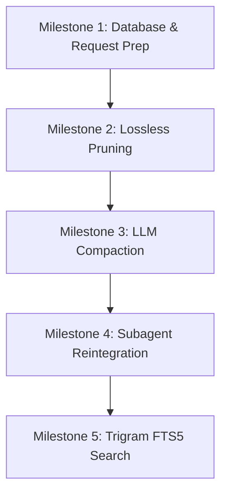

# Nav Context Management Plan

This plan synthesizes context management research across eight major agent implementations (`claudecode`, `codex`, `flue`, `hermes`, `kimiflare`, `nanoclaw`, `opencode`, `pi`) and combines their best design choices into a unified architecture tailored for the `nav` project.

---

## 1. Executive Summary

Context management is the primary operational constraint for long-running coding agents. An unmanaged context window results in skyrocketing API costs, broken prompt-cache hits, degraded reasoning, and eventual execution crashes.

For `nav` (a Rust backend with a React/Ink TUI), we will combine the **stateful DB-backed ledger** from `opencode`, the **prompt-cache stability rules** from `claudecode`, the **cheap lossless pruning** from `hermes` and `kimiflare`, the **incremental, structured summarization** from `pi` and `codex`, and the **isolated subagent task-loop** from `flue`.

### Core Principles
1. **Durable SQLite Ledger:** The SQLite database is the single source of truth for conversation history. Turn reconstruction happens on-demand per model invocation.
2. **Cache-First Request Assembly:** Every per-turn formatting decision is designed to protect Anthropic and OpenAI prompt-cache prefixes.
3. **Multi-Stage Compaction Escalation:** Run cheap, lossless truncation and pruning first. Run expensive LLM summarization only on threshold breaches or context-overflow errors.
4. **Task-Isolated Subagents:** Delegate sub-tasks to child sessions that run independently and report back via structured result envelopes to save parent context space.

### Product Posture
`nav` is a single-operator local coding agent, not a multi-tenant production service. The plan should optimize for Season's iteration speed, context quality, and recoverability. Default behavior can be aggressive: auto-prune, auto-compact, spawn subagents, and continue after recoverable errors when the ledger/artifact trail makes the action inspectable.

The safeguards that stay are the ones that protect the work: raw transcript/artifact fidelity, cancellation, loop breakers, conflict visibility, and clear TUI status when context is pruned or summarized. Avoid production-shaped ceremony such as policy-heavy permission systems, admin workflows, or strict global locks unless they prevent real local data loss.

---

## 2. Request Assembly & Cache-Control

Naively rebuilding the system prompt and conversation history on every turn churns cache prefixes, leading to 98% prompt cache misses. `nav` will implement a structured request builder focused on prefix stability.

```text
Assembled Request Shape:
┌───────────────────────────────────────┐
│ Block 1: Truly Static System Prompt   │  ◄── Cached once per session (cache-stable)
├───────────────────────────────────────┤
│ Block 2: Semi-Static Context          │  ◄── Refreshed on config/tool change (session-stable)
├───────────────────────────────────────┤
│ Block 3: Volatile Context & Memory    │  ◄── Recalled memory, date (no cache)
├───────────────────────────────────────┤
│ Message 0: Compact Summary (Synthetic)│  ◄── Compaction summary
├───────────────────────────────────────┤
│ Message 1..N: Retained Tail (User/AI) │  ◄── Verbatim turns
├───────────────────────────────────────┤
│ Message N+1: Last Turn User Input     │  ◄── Cache Control Ephemeral Marker
└───────────────────────────────────────┘
```

### 2.1 Stable-Dynamic System Prompt
The system prompt is divided into three blocks separated by `SYSTEM_PROMPT_DYNAMIC_BOUNDARY` to maximize cache hits:
*   **Block 1 (Static System Instructions):** Agent identity (persona), operational tone, and strict tool-usage rules. Model name and session state are excluded to ensure byte-identity remains intact even if models are swapped.
*   **Block 2 (Semi-Static Context):** Active tool definitions, working directory, OS, shell path, and available skills (name and description only; see §2.2).
*   **Block 3 (Volatile Context):** Today's date, git status, external memory prefetch data, and project instruction files (`CLAUDE.md`/`AGENTS.md`).

### 2.2 Progressive Skill & Instruction Disclosure
Rather than inlining large skill scripts or files directly into system messages:
1.  **Skills:** The prompt lists only the names, summaries, and paths of available skills. The model is instructed to read the specific `SKILL.md` using the `read` tool *only* when it decides to execute that skill (from `flue`/`claudecode`).
2.  **Context Files:** Concatenated project context files (`CLAUDE.md`/`AGENTS.md`) are kept in Block 3. To prevent mid-session edits from breaking the cache, the loaded file contents are memoized at session start, forcing updates to register only on restart or after a compaction event.

### 2.3 Context Reminders
Instead of appending instructions to the system prompt (which invalidates the cache on every change), we append context reminders as a `<system-reminder>` block inside the *last user message* in the array. This includes:
*   Plan-mode state indicators (e.g. `[Plan Mode: Active]`).
*   Output-format reminders (e.g., "Wrap all final answers in `<message to="...">`").

### 2.4 Cache Breakpoint Placement
Anthropic allows up to **4** `cache_control` breakpoints per request, reads the cache by automatically matching the longest previously-written prefix, and layers prefixes in a fixed hierarchy: **tools → system → messages**. Crucially, the read-lookback only scans **~20 content blocks** before an explicit breakpoint. `nav` places breakpoints to exploit this:

1.  **End of tool definitions** — tools are large and stable, so caching them is the single biggest win. They are schema-cached in-memory and sorted alphabetically (see below) so the bytes never churn.
2.  **End of the static system block** (the Block 1/2 boundary) — persona + tool-usage rules.
3.  **A rolling breakpoint on the last message, with the second-to-last message also kept as a breakpoint.** The pair matters in agentic turns: a single user turn can append far more than 20 tool-result blocks, pushing the previous cache write outside the read-lookback window, so one end-marker alone would miss. Keeping the prior breakpoint guarantees the read lands inside the window. This mirrors `pi` (system + last tool + last user), `hermes` (`system_and_3`), and `opencode` (first-2-system + last-2-non-system).

For fire-and-forget subagent forks, the rolling marker is shifted one message earlier so the fork's throwaway execution tail is never written to the shared cache.

> The `claudecode` "exactly one message-level marker" rule is an optimization for Anthropic's *internal* serving infra (mycro KV-page recycling) and does **not** transfer to the public Anthropic/OpenRouter API, where multiple breakpoints are explicitly supported and recommended. For OpenAI-family backends there are no breakpoints at all — set `prompt_cache_key` to the session id (per `codex`/`opencode`) and rely on server-side prefix caching. The OpenAI adapter should also expose `prompt_cache_retention` (`in_memory` by default, `24h` when the selected model/account supports it) rather than baking retention into the session model.

To ensure tool definitions do not churn the cache due to minor serialization variations, all tool schemas are cached in-memory (keyed by `name:hash(schema)`, per `claudecode`) and sorted alphabetically before formatting.

---

## 3. The Compaction Pipeline

`nav` will use a multi-stage compaction pipeline that escalates from cheap, local operations to model-driven summarization.

```text
Message Volume Growth ───────────────────────────────────────────►
[ Turn 1 ] [ Turn 2 ] [ Turn 3 ] [ Turn 4 ] [ Turn 5 ] [ Turn 6 ] [ Turn 7 ]

1. In-flight Truncation (At-Record):
[ Turn 1 ] [ Turn 2 ] [ Turn 3 ] [ Turn 4 ] [ Turn 5 ] [ Turn 6 (Truncated Tool) ]

2. Micro-compaction / Pruning (Lossless):
[ Turn 1 ] [ Turn 2 (Pruned to 1-line) ] [ Turn 3 (Pruned) ] [ Turn 4 ] [ Turn 5 ]

3. LLM Summarization (Lossy):
┌──────────────┐
│ Summary Turn │ ◄── [ Turn 1 .. 4 ] summarized by compaction agent
├──────────────┤
│ Turn 5 .. 7  │ ◄── Retained tail (verbatim)
└──────────────┘
```

### Stage 1: In-Flight Truncation & Deduplication (Lossless)
*   **Artifact-Backed Fidelity:** "Lossless" means only the model-visible replay is shortened. The canonical row keeps the full tool arguments, raw output bytes, attachments, `content_hash`, byte count, MIME type, and producing `turn_part_id`, either inline when small or in the artifact store when large. `expand_artifact` must be able to reconstruct the original value before pruning/compaction.
*   **Argument Projection:** Large tool inputs (e.g. writing a 100KB file) are executed and persisted in full, but their replay projection is truncated while preserving valid JSON syntax.
*   **Output Caps:** Individual tool outputs are capped in the model-visible `ToolResult` (e.g. `read` is capped at 4000 characters, `bash` is capped at 5000 characters). Full outputs are written to the artifact store and can be accessed via `expand_artifact`.
*   **Deduplication:** If the model runs the same read/grep command multiple times in a turn, older duplicate outputs are replaced at encode-time with `[Duplicate - see more recent tool result]`; the original part remains searchable and expandable.
*   **Historical Media Eviction:** Image and other media blocks are kept verbatim only for the last `keep_media_turns` (default 2) turns; older media is replaced with an `[image elided]` text placeholder at read-time. Images are by far the densest cost in the window (see §5.1), and some providers reject requests whose media outlives the model's media support — so this is both a budget and a correctness measure (from `kimiflare` old-image stripping, with `codex`/`claudecode` stripping images for the compaction call specifically).

### Stage 2: Micro-Compaction & Pruning (Lossless)
When active tokens exceed 60% of the context window, we run pruning.
*   We walk backward through history, keeping a tail budget of recent tool outputs intact (`PRUNE_PROTECT = 40K` tokens).
*   For older tool results, we set the `compacted_at` timestamp in SQLite. On next read, the encoder replaces the tool result content with a one-line summary:
    `[read_file] read src/main.rs: exit code 0, 1.2K chars.`
    The summary is a replay projection only; the raw part/artifact remains addressable for search, UI inspection, and `expand_artifact`.
*   Protected tools (like `skill` or `todo`) are exempted from pruning.

### Stage 3: LLM-Driven Compaction (Lossy)
Triggered when the total token count exceeds the `usable` threshold (context window minus completion buffer) or when a provider returns a context-overflow error.

*   **Overflow Replay:** When compaction is triggered *reactively* by a context-overflow error (not a threshold breach), the failed assistant turn is dropped, compaction runs, and the original triggering user turn is re-issued against the compacted context so no user input is lost (from `opencode`/`pi`/`flue`). A single-shot guard prevents an overflow → compact → overflow recovery loop.
*   **Tail Protection:** We keep the last `tail_turns` (default 2) or `keep_recent_tokens` (default 20K) verbatim.
*   **Split-Turn Handling:** If the cut point lands inside a tool-calling sequence, we split the turn. We run a separate summary of the in-progress turn's prefix and stitch it to the historical summary to avoid leaving orphan tool calls.
*   **Structured Template:** The summary is generated using a dedicated "compaction agent" using the following markdown template:
    ```markdown
    ## Goal
    [Overall user goal]

    ## Completed Actions
    1. ACTION - outcome [tool: name]

    ## Active State
    [Modified files, test status, running processes]

    ## Key Decisions
    [Important choices made and why]

    ## Files
    ### Read
    - path/to/file.rs
    ### Modified
    - path/to/config.toml (added DB connection pool)
    ```

    The `## Files` section is cumulative across compactions: the compaction prompt receives the previous summary's file lists and merges them with new file operations from the current compaction range. This prevents the model from re-reading files it already inspected after multiple compaction cycles (from `pi` and `flue`'s `readFiles`/`modifiedFiles` carry-forward).
*   **Iterative Compaction:** When updating a compacted conversation, the previous summary is fed into the compaction prompt alongside the new tail, rolling the summary forward rather than generating it from scratch.
*   **Summary Validation:** Before a compaction result is committed, parse for the required headings and reject empty or malformed sections. A malformed summary counts against the failure circuit breaker; it is not inserted as trusted context.
*   **PTL (Prompt Too Long) Retry:** If the compaction call itself fails with a context overflow, we drop the oldest message groups and retry.
*   **Compaction Model:** By default, compaction uses the same model as the active session for simplicity and because the compaction prompt is small relative to the full context. A config option (`compaction.model_override`) allows routing compaction to a cheaper/faster model (e.g., Haiku-class) when a long personal session would otherwise spend too much time or money summarizing itself. When the override is set, the cheaper model receives only the stripped transcript (no images, truncated tool results), not the full tool definitions.
*   **Zero-Cost Compaction Swap (Optional/Future):** In the background, a thread extracts the session summary into a file. If compaction is triggered and this file is up-to-date, we read the file directly, saving a 5-30s LLM call. This is an optimization for the common case where background extraction has already run; it is not required for the initial implementation.

### Stage 4: Failure & Thrashing Protection
Two independent guards wrap the compaction pipeline:
*   **Ineffectiveness (thrashing):** If two consecutive compactions each reclaim less than 10% of the active context window, further auto-compactions are suspended and the TUI displays a warning (from `hermes`).
*   **Failure circuit breaker:** If the compaction *call itself* fails (provider error, malformed summary) 3 consecutive times, auto-compaction is disabled for the session; rate-limit/5xx errors additionally trip a transient cooldown (~10 min) before retrying. This is not about protecting a production fleet; it is about stopping one stuck local session from wasting tokens and attention.

The two are distinct and must not share a counter: thrashing means compaction *succeeds but barely helps*; the breaker means compaction *cannot complete*. Both counters reset on a manual `/compact` or `/new`.

### Stage 5: Terminal Fallback (Compaction Still Too Large)
In rare cases, compaction succeeds (the summary is generated) but the total context — summary + retained tail — still exceeds the usable budget. This happens when the retained tail itself is very large (e.g., a single massive tool output in the last turn). In this case:
1.  Drop the summary (don't replace old history with a summary that doesn't help).
2.  Surface a terminal `ContextOverflowError` to the user via the TUI.
3.  The user can then manually `/compact` with a larger tail trim, `/new` to start a fresh session, or `expand_artifact` to inspect and remove the offending content.

This is `opencode`'s approach: a compaction that still overflows returns `"stop"` and the loop terminates. There is no automatic second-pass compaction — the risk of an infinite compact→overflow→compact loop outweighs the benefit.

---

## 4. Memory & SQLite Persistence

```text
SQLite Schema Relationships:
┌──────────────┐
│   sessions   │ ◄── Holds cost, token usage, settings, parent_id (lineage)
└──────┬───────┘
       │ 1
       │
       │ *
┌──────▼───────┐
│     runs     │ ◄── Logs execution attempts, status
└──────┬───────┘
       │ 1
       │
       │ *
┌──────▼───────┐
│    turns     │ ◄── Envelope (role, seq, metadata)
└──────┬───────┘
       │ 1
       │
       │ *
┌──────▼───────┐
│  turn_parts  │ ◄── Individual content blocks (Text, ToolCall, ToolResult, etc.)
└──────────────┘
```

`nav` will use the `turns` + `turn_parts` database model to store messages.
*   **Encode-on-Read, Decode-on-Write:** Turn history is stored in an API-agnostic format. We format the payload into provider-specific shapes (Anthropic Messages, OpenAI Chat Completions, etc.) at read-time, allowing users to switch models mid-session without data migration.
*   **Artifact References:** Large tool inputs/outputs and media attachments are stored once and referenced from `turn_parts`. Context pruning may replace the replay text, but it must not delete raw bytes until the retention policy explicitly expires them. FTS indexes the preview text immediately and can backfill raw artifact text where extraction is cheap.
*   **Reasoning-Block Fidelity Across Model Swaps:** Because turns are stored model-agnostically and may be replayed to a *different* model than produced them, signed/encrypted reasoning blocks (Anthropic signed thinking, OpenAI `reasoning.encrypted_content`) are re-sent verbatim **only** when the active model matches the one that produced them; otherwise the reasoning is downgraded to plain text so a foreign model does not reject the signature (from `opencode`'s model-match check and `codex`'s encrypted-reasoning preservation). Reasoning blocks older than the retained tail are dropped entirely to save tokens (`kimiflare`). This is a correctness prerequisite for the mid-session model switching above — without it, a switch produces a hard 400.
*   **In-Place Compaction Markers:** Compaction stays inside the same session for v1. A `Compaction` part marks the boundary, the next synthetic assistant text holds the summary, and the encoder replays `[compaction marker → summary → retained tail]`. `sessions.parent_id` remains for forks and subagent lineage, not automatic compaction rotation.
*   **Prefetch During Streaming:** Memory recall and skill-discovery lookups are kicked off *while the model is still streaming the previous response* (and consumed after tool execution), so their latency is hidden inside the turn rather than added to it (from `claudecode`'s streaming prefetch and `kimiflare`'s parallel pre-turn recall).
*   **Trigram FTS5 Search:** We will build virtual tables `turn_parts_fts` and `turn_parts_fts_trigram` over the parts table. The trigram tokenizer supports substring matching for multiline code, variables, and CJK characters.

---

## 5. Loop Guards

### 5.0 Main-Loop Step Budget
Every research subject caps the parent agent loop: `claudecode` uses a configurable max-turns, `opencode` has `agent.steps`, `kimiflare` caps at 50 iterations, `hermes` defaults to 90. Without this, a model stuck in a tool-calling loop runs until context overflow — wasting tokens, time, and money.

`nav` will enforce a configurable **step budget** (default 80 iterations) on the main agent loop. Each inner iteration (one model call + its tool batch) counts as one step. On the final step, the model is sent a synthetic assistant message instructing it that tools are now disabled and it must produce a text-only summary of its progress (from `opencode`'s `max-steps.txt` approach). This ensures the user always gets a useful response, even if the task wasn't completed.

### 5.1 Doom-Loop Guard
If the model emits the same tool call (same tool name + structurally identical arguments) **3 consecutive times**, the loop intercepts the third call and returns a synthetic error: `[doom_loop detected: tool X with identical arguments called 3 times. Try a different approach.]` (from `opencode`'s doom-loop permission check and `kimiflare`'s `recentToolCalls` window of 8 with threshold 2).

The signature is computed as `toolName + hash(canonical_json(args))` to be order-insensitive. This guard prevents the most common form of model looping — retrying the same failed edit or search — without blocking legitimate retries of slightly different calls.

---

## 6. Token Budgeting & Backpressure

Because `nav` is written in Rust, we want to avoid linking heavy BPE tokenizer crates (like `tiktoken`) unless necessary.

### 6.1 Hybrid Token Estimation
*   **Heuristic Counting:** We estimate tokens using a `chars / 3.8` heuristic for standard text and `chars / 2.0` for dense JSON tool inputs/outputs. Images are estimated from their pixel dimensions where known, falling back to a conservative flat ~`1600` tokens per resized image. Image estimates deliberately round **up**: under-counting media is the single most common cause of a session that reads "well under threshold" still hitting a hard `prompt_too_long` (a documented `claudecode` risk, where a flat 2000-token estimate undershot the real ~5300-token cost of a max-resolution image; `codex` budgets ~7.3 KB/image, `pi` 1200).
*   **Usage Feedback Loop:** On every provider response, we capture the exact `usage` metadata (`input_tokens`, `output_tokens`, `cache_read_tokens`, `cache_write_tokens`).
*   **Token Formula:** The active context size is calculated by taking the exact token count from the last provider response and adding the heuristic estimate for any messages appended *after* that response.

### 6.2 Two-Scope Budgeting
We track the token budget in two scopes:
1.  **Total Context Budget:** The absolute window limit of the model (e.g. 200K).
2.  **Body-After-Prefix Budget:** Tracks token growth of the active conversation after subtracting the system prompt and static context blocks. This prevents a large static system prompt from triggering premature compaction.

---

## 7. Subagents (Tasks)

`nav` will support first-class task delegation via a `task` tool that spins up subagents.

```text
Subagent Reintegration:
┌────────────────────────────────────────────────────────┐
│ Parent Session                                         │
├────────────────────────────────────────────────────────┤
│ User: Run tests and fix the config error.              │
│ Assistant: Spawning subagent to review the logs.       │
│ ToolCall [task]: { prompt: "Find config error in logs" }│
│ ToolResult [task]:                                     │
│   ┌────────────────────────────────────────────────┐   │
│   │ <task_result>                                  │   │  ◄── Single consolidated tool result
│   │ Status: completed                              │   │      (No subagent transcript clutter)
│   │ Summary: Found missing database url in config  │   │
│   │ </task_result>                                 │   │
│   └────────────────────────────────────────────────┘   │
└────────────────────────────────────────────────────────┘
```

### 7.1 Isolation & Sandbox Sharing
*   **State Isolation:** Each subagent runs as a distinct session with its own SQLite database entry, independent `IterationBudget` (default 50 rounds), and specific tool pool.
*   **Recursion Depth Cap:** Subagent spawning is bounded by `MAX_TASK_DEPTH` (default 4, from `flue`), enforced *in addition* to the per-agent `IterationBudget`. Because each child gets its own independent budget, a deep delegation tree can otherwise blow far past the parent's nominal round cap — a hazard called out explicitly in `hermes` (parent + children can each exceed the 90-round default). A child at max depth is denied the `task` tool entirely.
*   **Sandbox Sharing:** The child subagent shares the parent's working directory, filesystem view, and an environment snapshot, allowing it to inspect and modify code directly. It does **not** share a live shell process; shell cwd/env mutations inside a child stay inside that child unless they are written to files.
*   **Cancellation & Workspace Ownership:** Parent cancellation propagates to active children. Mutating subagents run optimistically in the shared workspace by default: they record before/after snapshots, changed files, and artifact IDs, then surface overlaps in the reintegration envelope. A strict per-file edit lock can exist as a debug/escape hatch, but it is not the default posture.

### 7.2 Prompt Slimming
To keep subagents cheap and focused, read-only subagents (e.g. `Explore` or `Plan`) do not inherit the parent's system context, git status, or `CLAUDE.md` files.

### 7.3 Reintegration Envelope
The parent agent never receives the subagent's raw message history. When the subagent completes, its final response is captured, wrapped in a size-capped `<task_result>` XML envelope (including `session_id`, status, runtime, changed files, artifact IDs, and the final output summary), and delivered as a **single** `tool_result` message to the parent. The child's detailed transcript remains in SQLite, accessible by the TUI via the subagent's `session_id` if the user needs to inspect its work.

---

## 8. Implementation & Verification Path

This plan will be implemented across the following milestones:



### Milestone 1: Database & Request Prep (LOOP-01, LOOP-02)
*   Implement the main-loop step budget (default 80) and the doom-loop guard (3 identical calls).
*   *Verification:* Assert that a loop emitting the same tool call 3× receives a synthetic error on the third attempt, and that a loop exceeding 80 steps terminates with a text-only final turn.
*   Implement `turns` and `turn_parts` schema in SQLite.
*   Build the stable-dynamic system prompt partitioner.
*   Add Anthropic/OpenAI prompt-cache adapters to the provider layer.
*   *Verification:* Run integration tests asserting that the serialized provider payload contains cache markers where supported, preserves `prompt_cache_key` / `prompt_cache_retention` on OpenAI-family requests, and remains byte-identical across identical turns.

### Milestone 2: Lossless Pruning (TOOL-03, TOOL-10)
*   Add artifact references for large tool arguments, raw tool outputs, and media attachments before enabling replay truncation.
*   Add `compacted_at` logic to `turn_parts` in SQLite.
*   Implement the pruning worker that truncates old tool results to one-line summaries.
*   Implement historical media eviction (`keep_media_turns`) at read-time.
*   *Verification:* Assert that (a) sending a 50KB tool result, executing pruning, and reloading the context yields a summary block under 200 characters while `expand_artifact` returns the full original bytes; (b) a large tool-call argument is executed/persisted in full but replayed as valid truncated JSON; and (c) a conversation with images across many turns sends full image blocks only for the last `keep_media_turns` and `[image elided]` placeholders for the rest.

### Milestone 3: LLM Compaction (APR-02, LOOP-05)
*   Implement the compaction agent loop.
*   Add the structured markdown compaction template with cumulative `## Files` tracking.
*   Build split-turn detection and PTL retry loops.
*   Validate compaction summaries before commit.
*   Build the failure circuit breaker and thrashing guard (Stage 4) as separate counters.
*   Implement the terminal fallback (Stage 5): if summary + tail still exceeds budget, surface `ContextOverflowError` rather than looping.
*   *Verification:* (a) Simulate a context-overflow response and verify that the system automatically triggers compaction, completes the summary, and replays the original user message successfully; (b) force the compaction call to error 3× and assert auto-compaction disables itself (rather than retry-looping) while a manual `/compact` still resets and runs; (c) verify that a second compaction merges the previous `## Files` section into the new summary rather than re-discovering the same files.

### Milestone 4: Subagent Reintegration (TOOL-11)
*   Implement the `task` tool in `nav-harness`.
*   Build tool-pool derivation and slimmed system prompt filters.
*   Add subagent task-result XML wrapping, cancellation propagation, and changed-file/conflict reporting.
*   *Verification:* Run a subagent task and assert that only a single size-capped tool result is appended to the parent's history, while the subagent's full history is persisted under its own session ID; cancel a parent run and assert the child is interrupted; run two mutating tasks and assert overlapping edits are surfaced in the parent result instead of disappearing into the transcript.

### Milestone 5: Trigram FTS5 Search (FTS-01)
*   Create virtual tables and sync triggers.
*   Implement search endpoints returning hits with bookended session starts and ends.
*   *Verification:* Query for code patterns inside old tool outputs and verify that the search matches CJK characters and multiline text.
